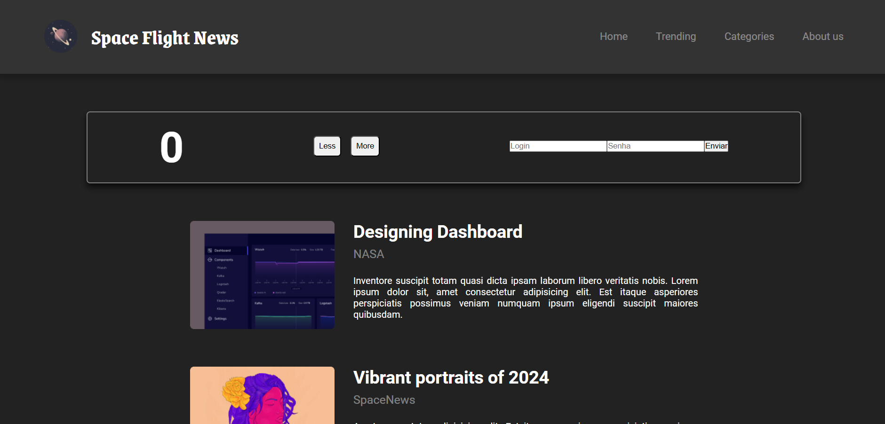

# React + Vite

Ministrado por Ada Tech, em parceria com a Santander, esse projeto foi desenvolvido para fins didáticos com objetivo de introduzir novos conhecimentos sobre React. 

- Componentização;
- Props;
- Estados;
- Ciclo de vida.

## Linguagens Utilizadas:
- HTML, 
- CSS e 
- React.

 ### 🎉 Agradecimentos 

_"Gratidão à todos os envolvidos nesse curso, Santander, Ada Tech e Let's Code que dedicaram seu tempo para formação de novos profissionais."_
